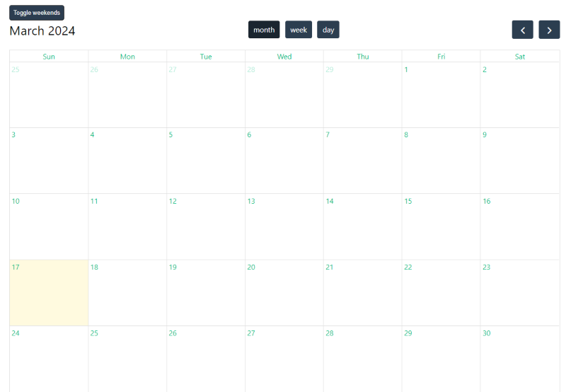

# Vue Calendar
Small calendar project made with [FullCalendar](https://fullcalendar.io/) to become acquainted with Vuejs.



## Features

- Displays a monthly calendar view 
- Toggle between month, week, and day view
- Toggle weekends
- Clicking on a day (month and week view) or a time (day view) registers that interaction

## Project Setup

1. Clone the repo
2. Install dependencies
    ```sh
    npm install
    ```

3.  Compile and Hot-Reload for Development
    ```sh
    npm run dev
    ```
